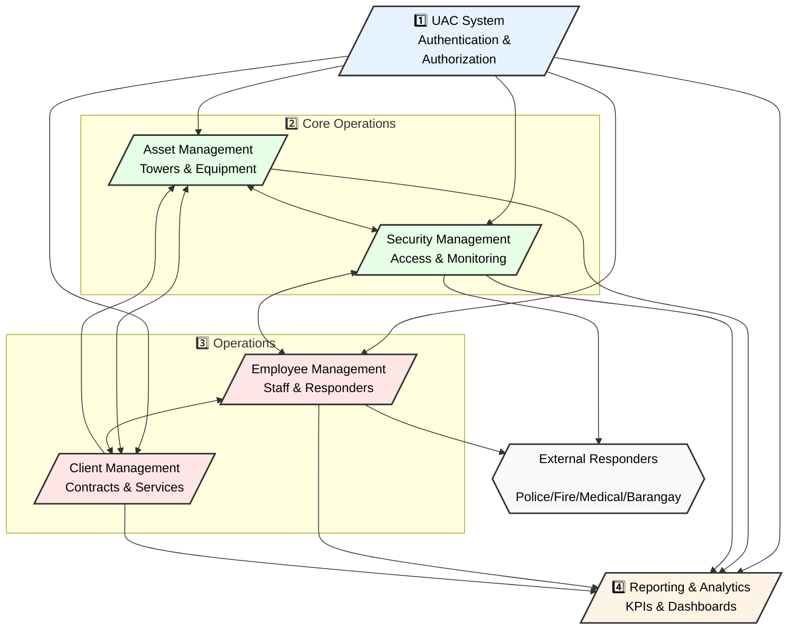

# PhilTower systems interconnect

Key System Flows:

1. **UAC (User Access Control)**
   - Controls access to all systems
   - Manages user permissions
   - Tracks all system activities
   - Handles authentication

2. **Core Operations**
   - **AMS (Asset Management)**
     * Manages physical infrastructure
     * Tracks equipment maintenance
     * Handles tower operations
   - **SMS (Security Management)**
     * Controls physical access
     * Manages security monitoring
     * Handles incidents
     * Coordinates with external responders

3. **Operations Management**
   - **EMS (Employee Management)**
     * Manages internal staff
     * Handles external responders
     * Tracks certifications
     * Manages schedules
   - **CMS (Client Management)**
     * Manages client relationships
     * Handles contracts
     * Tracks service delivery
     * Monitors SLAs

4. **RAS (Reporting & Analytics)**
   - Aggregates data from all systems
   - Provides KPI monitoring
   - Generates reports
   - Shows real-time dashboards

5. **External Integration**
   - Police coordination
   - Fire department response
   - Medical emergency response
   - Barangay coordination
