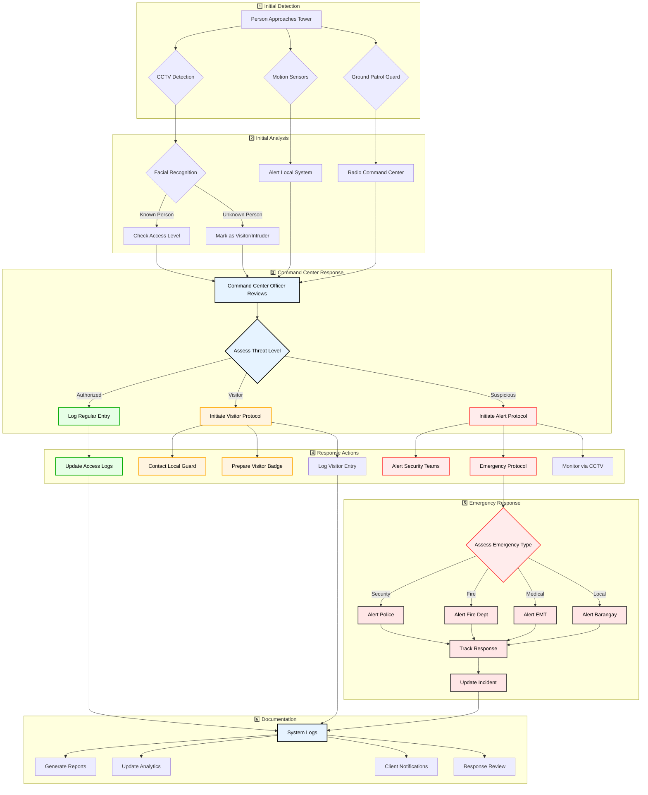

# Real-world security scenario
PhilTower Security System interact when someone approaches a tower, including human and automated responses.

1. **Emergency Response Integration**
   - Differentiated emergency types
   - Specific responder activation
   - Response tracking
   - Incident updates

2. **Response Categories**
   - Security incidents (Police)
   - Fire emergencies
   - Medical emergencies
   - Local issues (Barangay)

3. **Response Management**
   - Coordinated response tracking
   - Real-time status updates
   - Response time monitoring
   - Performance review

4. **Documentation Expansion**
   - Comprehensive system logs
   - Automated reporting
   - Analytics integration
   - Response evaluation

5. **Key Integration Points**
   - SMS ↔ External Responders
   - EMS ↔ Response Teams
   - RAS ↔ Performance Analytics
   - CMS ↔ Client Communications
